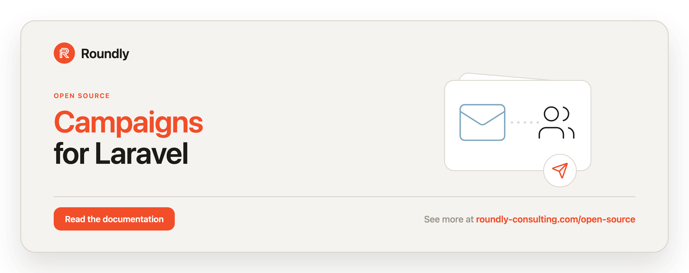

<!-- roundly-hero:start -->
<p align="center">
  <a href="https://roundly-consulting.com/open-source/docs/campaigns-for-laravel?utm_source=github&utm_medium=readme&utm_campaign=open-source&utm_content=campaigns-for-laravel">
    
  </a>
</p>
<!-- roundly-hero:end -->

# Campaigns for Laravel

Send campaigns to many recipients using Laravel queues and job batches. The package is
storage-agnostic: it ships an in-memory manager out of the box and an optional, opt-in
database-backed manager, and it lets you swap the per-recipient delivery job so the same
campaign engine can deliver email, SMS, push notifications, or Laravel notifications.

## Requirements

- PHP `^8.4`
- Laravel `^12.0` or `^13.0`

## Installation

Install via Composer:

```bash
composer require roundly-consulting/campaigns-for-laravel
```

Optionally publish the config file:

```bash
php artisan vendor:publish --tag="campaigns-config"
```

The package works with **zero database setup** by default (the in-memory manager). Only if
you switch to the database manager do you need to publish and run its migrations:

```bash
php artisan vendor:publish --tag="campaigns-migrations"
php artisan migrate
```

You can also publish the translations:

```bash
php artisan vendor:publish --tag="campaigns-translations"
```

## Configuration

The published config file (`config/campaigns.php`):

```php
return [
    'manager' => env('CAMPAIGNS_MANAGER', \RoundlyConsulting\Campaigns\Managers\InMemoryManager::class),
    'batch-queue' => env('CAMPAIGNS_BATCH_QUEUE', 'default'),
    'sending-queue' => env('CAMPAIGNS_SENDING_QUEUE', 'default'),
    'process-recipient-job' => \RoundlyConsulting\Campaigns\Jobs\SendCampaignEmail::class,
    'notification' => env('CAMPAIGNS_NOTIFICATION'),
    'notification-channel' => env('CAMPAIGNS_NOTIFICATION_CHANNEL', 'mail'),
];
```

| Key | Type | Default | Description |
|---|---|---|---|
| `manager` | `class-string` | `InMemoryManager::class` (env `CAMPAIGNS_MANAGER`) | The `Manager` implementation bound in the container. Set to `DatabaseManager::class` to persist campaigns, or point at your own. |
| `batch-queue` | `string` | `default` (env `CAMPAIGNS_BATCH_QUEUE`) | Queue used for the campaign batch. |
| `sending-queue` | `string` | `default` (env `CAMPAIGNS_SENDING_QUEUE`) | Queue used for each per-recipient processing job. |
| `process-recipient-job` | `class-string` | `SendCampaignEmail::class` | The job dispatched once per recipient. Must implement `Contracts\ProcessesCampaignRecipient`. |
| `notification` | `class-string\|null` | `null` (env `CAMPAIGNS_NOTIFICATION`) | A `Notifications\CampaignNotification` subclass delivered by `SendCampaignNotification`. |
| `notification-channel` | `string` | `mail` (env `CAMPAIGNS_NOTIFICATION_CHANNEL`) | Routing channel for `SendCampaignNotification`'s on-demand notifiable. |

## Usage

### The `Campaigns` facade (recommended)

The fastest way to create, address, and send a campaign is the fluent builder behind the
`Campaigns` facade. UUIDs are generated for you.

```php
use RoundlyConsulting\Campaigns\Facades\Campaigns;

$campaign = Campaigns::create('Buy today and spend less', '<p>Hello dear customer!</p>')
    ->from('no-reply@eshop.tld', 'Best E-Shop Ever')
    ->to(['john@doe.tld', 'jane@doe.tld'])
    ->dispatch();

// Inspect progress later.
$campaign = Campaigns::find($campaign->uuid);
$campaign->progress->percentage();   // float, e.g. 42.5
$campaign->progress->remaining();    // int recipients left
$campaign->progress->isRunning();    // bool
$campaign->progress->isComplete();   // bool

// Cancel a running campaign and its batch.
Campaigns::cancel($campaign->uuid);
```

`->to()` is additive and accepts an email/route string, a `CampaignRecipient`, or any
iterable of those. Use `->prepare()` instead of `->dispatch()` to create the batch and leave
the campaign `Pending` without sending. `->uuid()`, `->subject()`, and `->content()` override
the builder's defaults.

### The low-level `Manager`

The facade is sugar over the configured `Manager`, which you can still drive directly:

```php
use RoundlyConsulting\Campaigns\Campaign;
use RoundlyConsulting\Campaigns\CampaignRecipient;
use RoundlyConsulting\Campaigns\Managers\Manager;

/** @var Manager $manager */
$manager = resolve(Manager::class);

$manager->prepare(new Campaign(
    uuid: 'e184d08f-5081-4fbb-9604-7a2460c3fb3a',
    subject: 'Buy today and spend less',
    content: 'Hello dear customer!',
    fromName: 'Best E-Shop Ever',
    fromAddress: 'no-reply@eshop.tld',
));

$manager->pushRecipientsToCampaign('e184d08f-5081-4fbb-9604-7a2460c3fb3a', [
    new CampaignRecipient(uuid: '7f3eb754-709e-4837-b82a-49c83223eed6', name: 'John Doe', reachableAt: 'john@doe.tld'),
]);

$manager->start('e184d08f-5081-4fbb-9604-7a2460c3fb3a');
```

`start()`, `cancel()`, and `findOrFail()` throw `Exceptions\CampaignNotFound` when the uuid is
unknown; `find()` returns `null`.

### Value objects

- `Campaign` — `uuid`, `subject`, `content`, `fromName`, `fromAddress`, `progress`,
  `startedAt`, `endedAt`, `batch`, and `toArray()`.
- `CampaignProgress` — `status`, `sent`, `pending`, `total`, plus `percentage()`,
  `remaining()`, `isRunning()`, `isComplete()`, and `toArray()`.
- `CampaignRecipient` — `uuid`, `name`, `reachableAt`, `hasBeenProcessed`, `errorOccured`,
  `errorMessage` (`null` when no error), and `toArray()`.
- `Enums\CampaignStatus` — `Created`, `Pending`, `Processing`, `Completed`, `Failed`,
  `Canceled`, plus `isTerminal()` and `label()`.

### Events

Listen to lifecycle and recipient events to drive logging, dashboards, metrics, or webhooks:

- `Events\CampaignPrepared`, `Events\CampaignStarted`, `Events\CampaignCompleted`,
  `Events\CampaignFailed`, `Events\CampaignCancelled` — each carries the `Campaign`.
- `Events\RecipientProcessed` — carries the `Campaign` and `CampaignRecipient`.
- `Events\RecipientFailed` — carries the `Campaign`, `CampaignRecipient`, and `error` string.

### Choosing a delivery channel

Each recipient is processed by the job at `campaigns.process-recipient-job`. Two are shipped,
and both implement `Contracts\ProcessesCampaignRecipient`:

- **`Jobs\SendCampaignEmail`** (default) — sends the campaign content as an email.
- **`Jobs\SendCampaignNotification`** — delivers via Laravel's notification system. Point
  `campaigns.notification` at a `Notifications\CampaignNotification` subclass (constructed with
  the `Campaign` and `CampaignRecipient`) and set `campaigns.notification-channel` to the route
  channel (e.g. `mail`, `vonage`, `fcm`).

```php
use RoundlyConsulting\Campaigns\Notifications\CampaignNotification;

final class ProductLaunchNotification extends CampaignNotification
{
    public function via(object $notifiable): array
    {
        return ['mail'];
    }

    public function toMail(object $notifiable)
    {
        return (new \Illuminate\Notifications\Messages\MailMessage)->line($this->campaign->content);
    }
}
```

To deliver via SMS, push, or any other transport, implement
`Contracts\ProcessesCampaignRecipient` in your own job and set `campaigns.process-recipient-job`
to it. The job is constructed with the `Campaign` and `CampaignRecipient` and should call
`markRecipientAsProcessed()` / `markRecipientAsFailed()` on the injected `Manager`.

### Persistence (optional database manager)

`InMemoryManager` (default) keeps campaigns in static arrays — ideal for tests and
create-and-send flows. For persisted campaigns (delayed starts, dashboards, retries, audit),
switch to the shipped database manager with one config change:

```dotenv
CAMPAIGNS_MANAGER="RoundlyConsulting\Campaigns\Managers\DatabaseManager"
```

Then publish and run the migrations (see Installation). The database manager stores campaigns
in `CampaignRecord` / `CampaignRecipientRecord` Eloquent models and behaves identically to the
in-memory manager (the two are proven equivalent by a shared contract test suite). You can
also implement `Managers\Manager` yourself against any storage and point `campaigns.manager`
at it.

### Console commands

List campaigns and their progress:

```bash
php artisan campaigns:list --offset=0 --limit=10
```

Cancel a campaign by uuid:

```bash
php artisan campaigns:cancel {uuid}
```

| Command | Argument / option | Description |
|---|---|---|
| `campaigns:list` | `--offset=0`, `--limit=10` | Paginated table of campaigns and progress. |
| `campaigns:cancel` | `{uuid}` | Cancel a campaign and its batch; non-zero exit on unknown uuid. |

## Testing

```bash
composer test
```

## Changelog

See [CHANGELOG](CHANGELOG.md).

## License

The MIT License (MIT). See [LICENSE.md](LICENSE.md).
